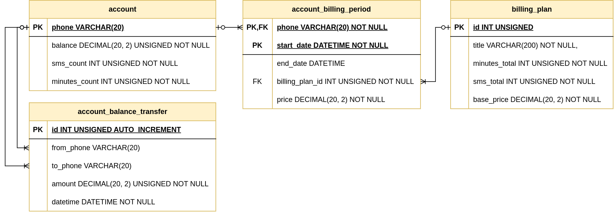

# Пример: работа с транзакциями и блокировками на примере биллинга мобильного оператора

Пример для курса "Базы данных", сделан на PHP8 и MySQL8, проверен на Linux.

>Данный пример не содержит скриптов для Web-сервера — здесь только код, покрытый интеграционными тестами.

## Схема БД

## Запуск примера на Linux

Краткий план действий:

1. Установить docker и docker-compose
2. Запустить контейнер MySQL: `docker-compose up`
3. Открыть в MySQL Workbench и выполнить последовательно SQL запросы из файла:
   - `data/init_billing_schema.sql`
4. Запустить тесты: `composer tests`

## Запуск примера в Windows

Краткий план действий:

1. Установить MySQL 8 и PHP 8.2
2. Запустить MySQL server
3. Открыть в MySQL Workbench и выполнить последовательно SQL запросы из двух файлов:
   - `data/create_database_and_user.sql`
   - `data/init_billing_schema.sql`
4. Запустить тесты: `composer tests`
